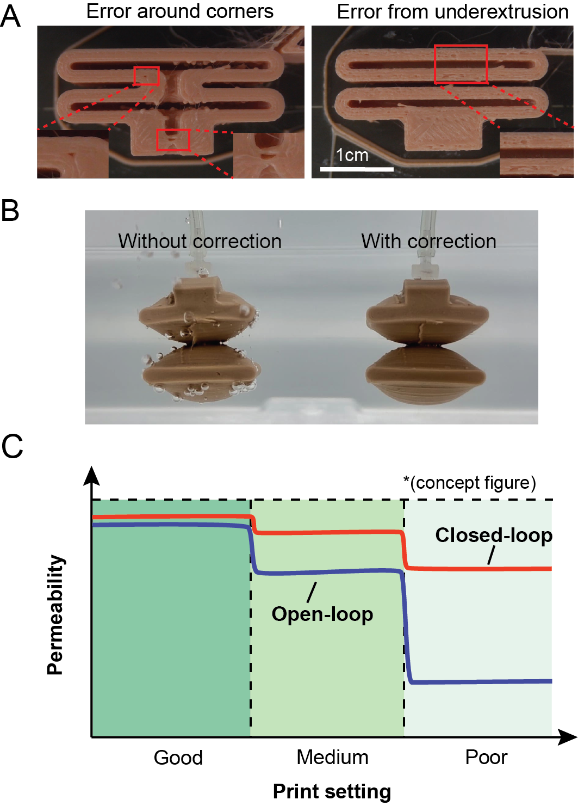
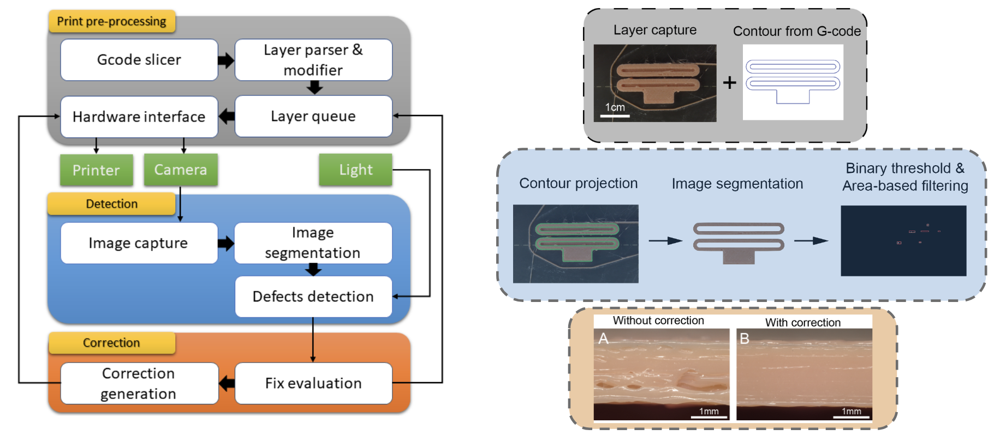
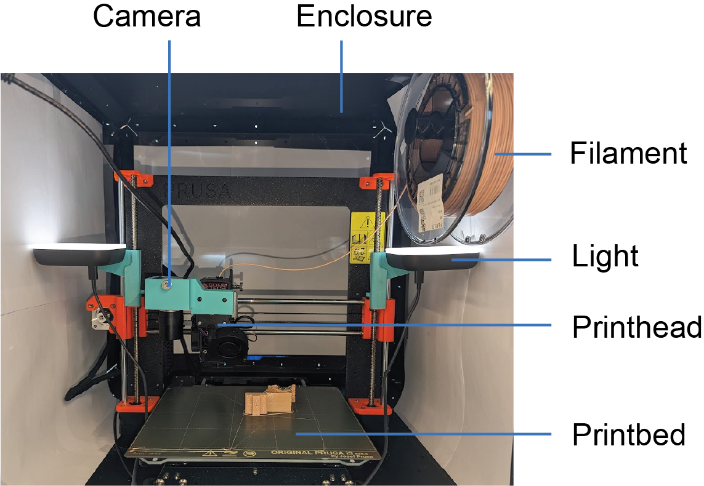

# Closed-loop printing system

This repository contains the source code for our paper:  
[Vision-based FDM Printing for Fabricating Airtight Soft Actuators](https://arxiv.org/abs/2312.01135)

7th IEEE-RAS International Conference on Soft Robotics (Robosoft 2024)  
Yijia Wu,$^{\dagger}$ Zilin Dai,$^{\dagger}$ Haotian Liu, Lehong Wang, and Markus P. Nemitz  
(${\dagger}$ These authors contribute equally to this work)

This paper propose a low-cost approach to improve the print quality of desktop fused deposition modeling by adding a webcam to the printer to monitor the printing process and detect and correct defects such as holes or gaps. We demonstrate that our approach improves the air-tightness of printed pneumatic actuators while reducing the need for fine-tuning printing parameters. Our approach presents a new option for robustly fabricating airtight, soft robotic actuators.

## Hardware setup
**FDM Printer:** Prusa MK3S  
**Enclosure:** Prusa enclosure  
**Camera:** ELP IMX317USB 4K Webcam  
**Lights:** Logitech Litra Glow sources

  

1. If the same camera and light sources are used, print `camera_holder`, and two `led_light_mount` in the `CAD` folder. Otherwise, prepare your own mounts for camera and lights
2. Mount camera and lights on the printer properly
3. Put the printer inside a fully blackout enclosure
4. Connect camera and printer to the computer
5. Tune the printer to be able to print TPE filament

## Software setup
1. clone this repository and [Printrun](https://github.com/kliment/Printrun) library
2. clone the `printrun` folder, `printcore.py`, and `setup.py` from the Printrun repository to this folder
3. install required libraries
    * python 3.11
    * pyserial 3.5
    * opencv 4.7.0

## How to use

1. Camera instrinsic and extrinsic calibration
2. Put parsed G-code files into a self-contained directory named "gcode"
    * Two gcode files are required for running this code, one parsed with z-wipping pattern, one without
3. Create directories for storing layerwise parsed g_code files, images, and log files
4. Change the camera matrix, path, parameters in `iron_detect_and_correct.py`
5. Run `iron_detect_and_correct.py`